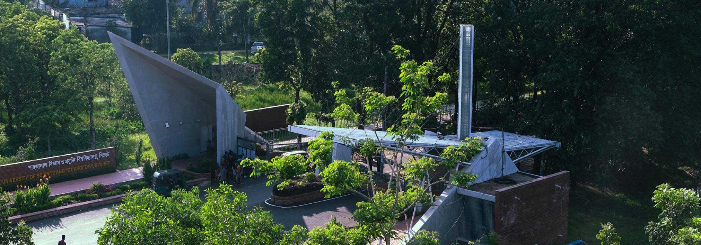
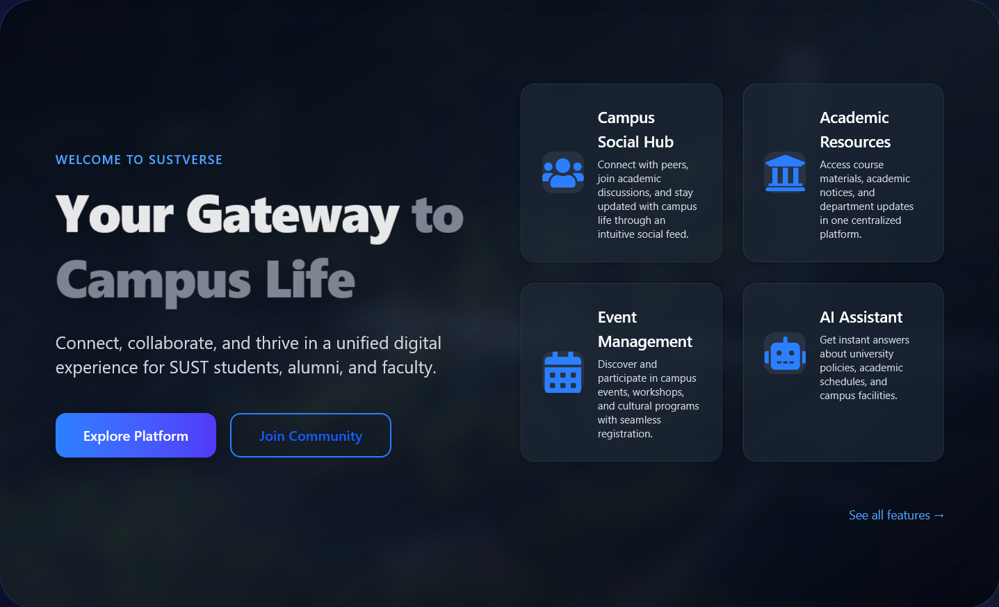
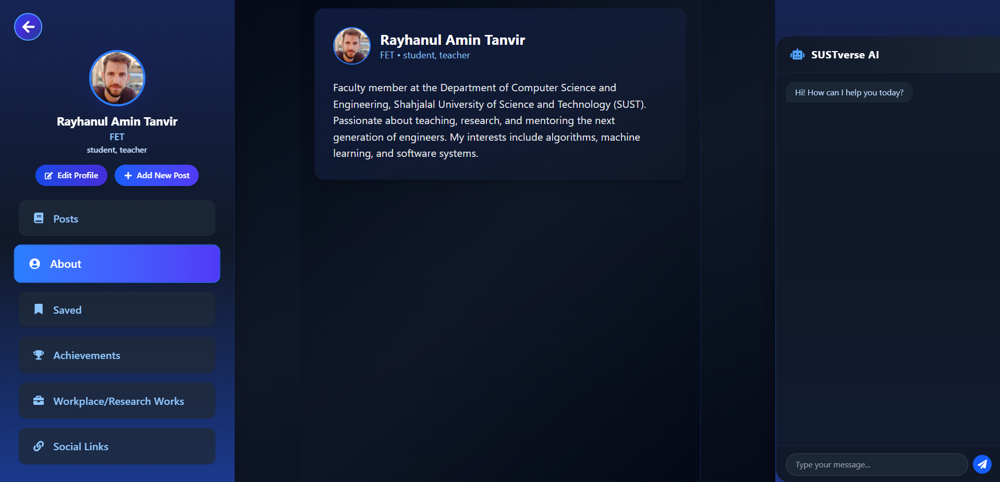
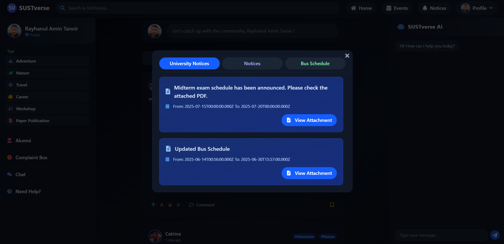
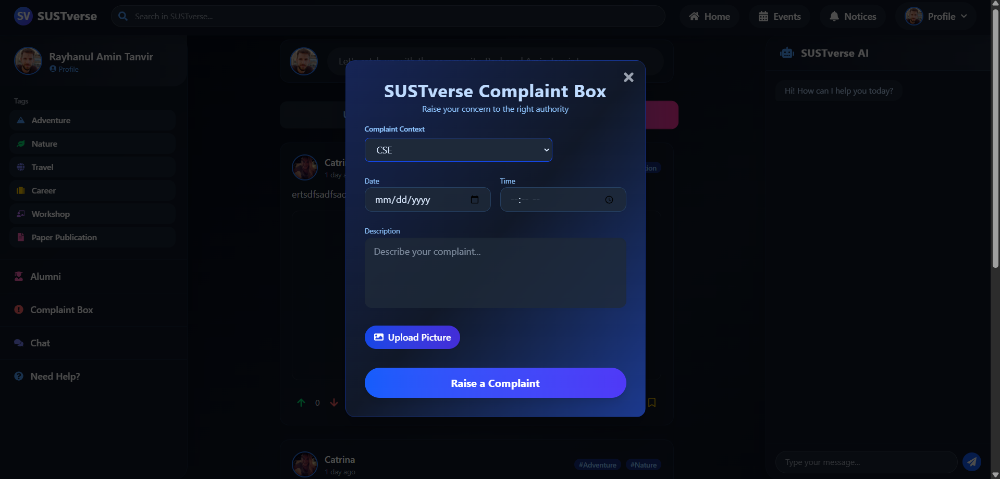

# 🌐 SUSTverse – A Unified Campus Communication Platform

># Bringing students, alumni, and administrators together on one platform to streamline communication, manage events, and foster collaboration at SUST.

---
  

## 📚 Table of Contents

- [📌 Project Overview](#project-overview)
- [❗ Problem Statement](#problem-statement)
- [✅ Proposed Solution](#proposed-solution)
- [🧩 Key Features](#key-features)
- [⚙️ Technology Stack](#technology-stack)
- [📱 Future Enhancements](#future-enhancements)
- [⚙️ Installation & Setup](#installation--setup)
- [🖼️ Screenshots](#screenshots)
- [👥 Contributors](#contributors)

---
  

# 📌 Project Overview

**SUSTverse** is a full-stack platform built for the Shahjalal University of Science and Technology (SUST) to create a connected, transparent, and interactive digital ecosystem. It centralizes event coordination, notice distribution, alumni networking, anonymous feedback, and 24/7 information access — all in one place.

---
  

# ❗ Problem Statement

Currently, communication at SUST is fragmented across social media, printed notices, and informal channels. This leads to:

- Inefficiency in managing events and notices
- Lack of student-admin engagement
- No centralized platform for alumni interaction
- Zero support for real-time updates or FAQs
- Missing anonymous feedback options

---
  

# ✅ Proposed Solution

SUSTverse addresses these challenges through:

- Seamless communication between all university stakeholders
- A centralized hub for events, notices, and announcements
- A robust alumni network and messaging interface
- Confidential complaint submission with progress tracking
- An AI-powered chatbot for real-time, multilingual support

---
  

# 🧩 Key Features

## 🏠 Home Page
- Post campus news, discussions, and media
- Comment, react, and view trending topics
- Filter and search content easily
 

## Update of the Bus Schedule

## Profile page of the user

 

## 🎉 Event Page
- List upcoming and past events with full details
- Support for paid promotions and admin approvals
- Calendar link integration

## New Post Creation

## New Event Creation

## 📢 Notice Board
- Department-specific boards with admin-only publishing
- Real-time notifications and searchable archive

## 🎓 Alumni Section
- Alumni directory with search and connection tools
- Messaging system and experience sharing
- Internship and job advice posts

## 🧾 Anonymous Complaint Box
- Submit complaints confidentially
- Track progress of submitted issues
- Admin tools for analytics and reporting

## 🤖 AI Chatbot (24/7 Support)
- Natural language answers to FAQs and queries
- Multilingual support (English & Bangla)
- Personalized suggestions and policy updates

---
  

# ⚙️ Technology Stack

| Layer           | Technology                             | Description                                 |
|----------------|-----------------------------------------|---------------------------------------------|
| Frontend       | React.js, Material-UI                   | Modern UI and responsive design             |
| Backend        | Node.js, Express.js                     | Scalable server-side logic and APIs         |
| Database       | MySQL / MongoDB Atlas                   | Structured or NoSQL data management         |
| Auth           | JWT (JSON Web Tokens)                   | Secure user login and session handling      |
| Hosting        | AWS / Google Cloud (TBD)                | Cloud-based deployment                      |
| AI Integration | OpenAI GPT / Custom LLM (via REST API)  | Smart chatbot with contextual responses     |
 

---

# 📱 Future Enhancements

- 🔄 Real-time chat system
- 📊 Survey and feedback module
- 📱 Mobile apps for Android & iOS
- 🌙 Dark/light theme support
- 🔔 Push notifications

---
 
 
 

# ⚙️ Installation & Setup

## 🔧 Prerequisites

Make sure you have the following installed:

- [Node.js](https://nodejs.org/) (v18 or later)
- [npm](https://www.npmjs.com/)
- [Git](https://git-scm.com/)
- A running instance of **MongoDB** or **MySQL**

---
   

# 🚀 Quick Start

## 1️⃣ Clone the repository
git clone https://github.com/yourusername/sustverse.git
cd sustverse

## 2️⃣ Install dependencies
npm install

## 3️⃣ Run the development server
npm run dev

   

# 🖼️ Other screenshots of the platform

## Contact with us through SUSTverse

## Admin Page Notice Creation

## Admin Page Notice View

## 👥 Contributors

<table>
  <tr>
    <td align="center">
      <a href="https://github.com/rayhanulamint2">
        
         
        <b>Rayhanul Amin Tanvir</b>
      </a>
       
      📧 rayhanulamint2@gmail.com
    </td>
    <td align="center">
      <a href="https://github.com/KhalidBinSelim">
        
         
        <b>Khalid Bin Selim</b>
      </a>
       
      📧 khalidbinselim@gmail.com
    </td>
    <td align="center">
      <a href="https://github.com/IM-Sajid">
        
         
        <b>Iqbal Mahmood Sajid</b>
      </a>
       
      📧 imsajid428@gmail.com
    </td>
  </tr>
</table>

